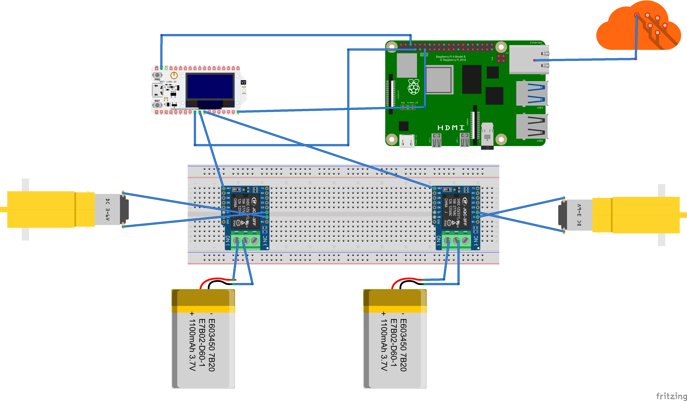

# Garderob — Smart Wardrobe (IoT + Computer Vision + MQTT)

A smart wardrobe prototype that identifies a garment placed on a conveyor
belt using a CNN classifier, then physically sorts it by triggering a
motorized door — coordinated over MQTT between a Raspberry Pi (vision +
inference) and an ESP32 (motor control), with a Django web app as the
control panel.



## How it works

```
[Camera + Pi]  --photo-->  [Keras CNN]  --classification-->
   --MQTT "esp32/motors"-->  [ESP32]  --GPIO/PWM-->  [Conveyor + Door motors]
```

1. **Capture & classify** (`modelo/esp32_temp.py`): a Raspberry Pi camera
   takes a photo of the garment, which is resized to 28x28 grayscale and
   classified by a Keras/TensorFlow CNN into 10 garment categories
   (T-shirt, Trouser, Pullover, Dress, Coat, Sandal, Shirt, Sneaker, Bag,
   Ankle boot — Fashion-MNIST label set).
2. **Actuation** (`mqtt/mqtt.ino`): an ESP32 subscribes to `esp32/motors`
   over MQTT and drives two DC motors — one for the conveyor belt
   ("banda"), one for the sorting door — using interrupt-driven,
   timer-based pulses (`hw_timer_t`) instead of blocking `delay()` calls,
   so the motor cutoff happens on a hardware timer regardless of what the
   main loop is doing.
3. **Control panel** (`garderop/`): a Django app (`armario` for the
   wardrobe logic, `users` for auth) exposes a web UI that triggers a
   classification cycle (`img_call` view, behind `@login_required`) and
   displays the result.

See [`Diagrama Flujo.pdf`](./Diagrama%20Flujo.pdf) and
[`DiagramaBloques.pdf`](./DiagramaBloques.pdf) for the full flow and
block diagrams.

## Components

| Layer | Tech | Location |
|---|---|---|
| Vision + inference | Python, TensorFlow/Keras, `picamera` | `modelo/esp32_temp.py` |
| Actuation | Arduino (ESP32), `PubSubClient` (MQTT) | `mqtt/mqtt.ino` |
| Messaging | MQTT (Mosquitto or similar broker) | — |
| Web control panel | Django | `garderop/` |

## Running it

This is a multi-device system — each piece runs on different hardware:

**MQTT broker** (any machine on the same network):
```bash
mosquitto -p 1883
```

**ESP32** (Arduino IDE or `arduino-cli`):
- Flash `mqtt/mqtt.ino`, setting `ssid`, `password`, and `mqtt_server`
  (broker IP) at the top of the file.

**Raspberry Pi** (vision + inference):
```bash
pip install picamera tensorflow paho-mqtt pillow numpy
python modelo/esp32_temp.py
```
Requires a trained model at the path referenced in `esp32_temp.py`
(`model.h5` — a Fashion-MNIST-style CNN).

**Web control panel**:
```bash
cd garderop
pip install django
python manage.py migrate
python manage.py runserver
```

## Notes on current state

- The MQTT broker IP and model/photo file paths are hardcoded (e.g.
  `172.20.10.7`, `/home/pi/Desktop/project/model.h5`) rather than
  read from environment variables or a config file — fine for a single
  prototype, but worth externalizing before running on a second device.
- `db.sqlite3` is committed to the repo; for a portfolio version this
  is usually excluded via `.gitignore`.

## Author

Andres Santiago Ducuara Velasquez ([@AndresTY](https://github.com/AndresTY))